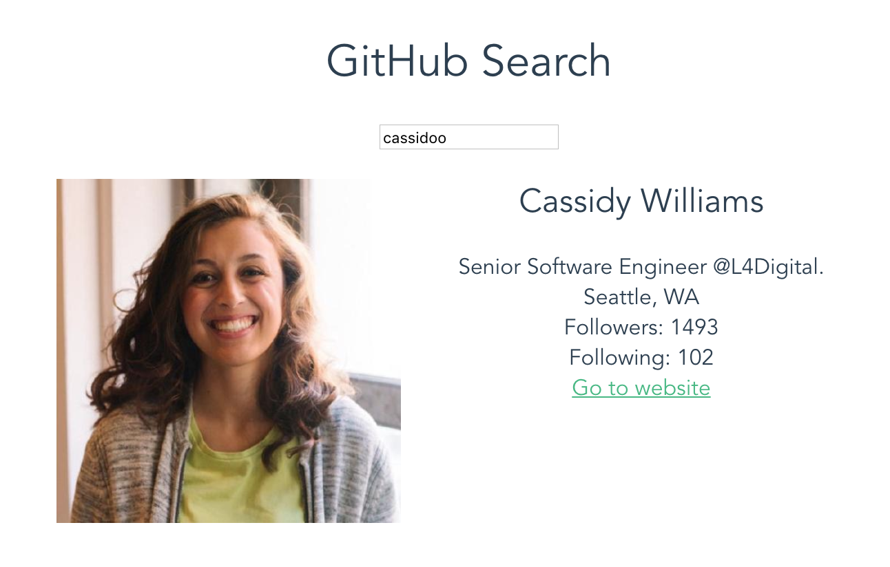

# github-user-search

A Vue.js project live-coded for [this webinar](https://www.shopify.com/partners/blog/free-webinar-vue-js-from-the-backend-building-a-robust-front-end-to-compliment-your-backend)



## Build Setup

``` bash
# install dependencies
npm install

# serve with hot reload at localhost:8080
npm run dev

# build for production with minification
npm run build

# build for production and view the bundle analyzer report
npm run build --report
```
